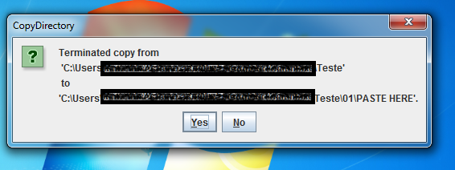

<h1>CopyDirectory</h1>

<p>The <a href="src/copy_directory/CopyDirectory.java">CopyDirectory</a> is the main class of this program. This program question the user in your init with two <code>JOptionPane#showInputDialog(java.awt.Component, Object, String, int)</code> that resquest the values of the <code>String copyString</code> and <code>String pasteString</code> and his respectives paths (<code>copyPath</code> and <code>pastePath</code>). Then it will create a <code>StringBuilder</code> named <code>sbLog</code> that receive all logs of this copy, like the init time, all files copied and pasted and, the end time.</p>

<table>
  <tr>
    <td></td>
    <td>
      <p>This show the <code>JOptionPane</code> that receives the path to copy.</p>
    </td>
  </tr>
  
  <tr>
    <td></td>
    <td>
      <p>This show the <code>JOptionPane</code> that receives the path to paste.</p>
    </td>
  </tr>
</table>

<p>To prevent an infinite recursion error, caused when the <code>pastePath</code> is inside the <code>copyPath</code> this program then checks for the existence of this possible error in a <code>try block</code>. First is stored in two <code>String</code> objects the absolute path of <code>copyPath</code> and <code>pastePath</code>. Then verify if <code>absPastePath</code> contains <code>absCopyPath</code> with the method <code>String#contains(CharSequence)</code>. If it is true, is throwed a new <code>InputMismatchException#InputMismatchException(String)</code>, that receive in the <code>String</code> parameter a detail message that explains the error. Then, in the <code>catch</code> block, is showed a <code>JOptionPane#showMessageDialog(java.awt.Component, Object, String, int)</code> that warns of the error and terminate the program with a <code>System#exit(int)</code> as parameter <code>-1</code> to indicates unsuccessful termination with Exception.</p>

<table>
  <tr>
    <td></td>
    <td>
      <p>This is a possible case where is noted a infinite loop caused by recursivity.</p>
    </td>
  </tr>
  
  <tr>
    <td></td>
    <td>
      <p>This image shows a JOptionPane that explains a error and his path of copy and path, it's after exit the program with <code>System#exit(-1)</code>.</p>
    </td>
  </tr>
</table>


<p>With the <code>Files#walk(Path, java.nio.file.FileVisitOption...)</code> that returs a <code>Stream</code> of <code>Path</code>, this program will try traverse this <code>Stream&#60;Path&#62;</code> with a <code>Stream#forEach(Consumer)</code>. As this <code>Consumer</code> is passed a <code>lambda</code> with the parameter <code>p</code> of type <code>Path</code> and int the body the process of copy and paste.</p>

<p>Into the body of the consumer, the program will try create a <code>Path</code> named <code>q</code> that receive the <code>pastePath.resolve(copyPath.relativize(p))</code>. Then print what file is being copied and what file is being pasted. Next, test with the <code>Files#isDirectory(Path, java.nio.file.LinkOption...)</code> if <code>p</code> (the path being copied) is a directory, if the test is true, is created the directory <code>q</code> (the path being pasted) with the method <code>Files#createDirectory(Path, java.nio.file.attribute.FileAttribute...)</code>; else the file on the path <code>p</code> is copied to the path <code>q</code> with the method <code>Files#copy(Path, Path, java.nio.file.CopyOption...</code>.</p>
  
<p>After the scope of the <code>try</code> that contains the <code>Files#walk(Path, java.nio.file.FileVisitOption...)</code> is terminated and processed the log, finally it is writed.</p>
  
<p>Finally is showed in a <code>JOptionPane#showConfirmDialog(java.awt.Component, Object, String, int)</code> a message notifying the finish of the copy from <code>copyPath</code> to <code>pasteString</code>.</p>

<h2>One sample of Log</h2>
<p>The following text block is a sample of logs storeds in the <a href="src/logs/export.log">export.log</a> file:</p>

```$$
InitTime=2023-12-15T16:30:20.847093500
CreateDirectory=>C:\Users\Reinaldo\Documents\Minhas paletas\doc João\Hello\01
CopiedFile=>C:\Users\Reinaldo\Documents\Minhas paletas\doc João\Teste\01\arq.txt->C:\Users\Reinaldo\Documents\Minhas paletas\doc João\Hello\01\arq.txt
CreateDirectory=>C:\Users\Reinaldo\Documents\Minhas paletas\doc João\Hello\01\PASTE HERE
CopiedFile=>C:\Users\Reinaldo\Documents\Minhas paletas\doc João\Teste\File.txt->C:\Users\Reinaldo\Documents\Minhas paletas\doc João\Hello\File.txt
EndTime=2023-12-15T16:30:20.956293700
----
```
